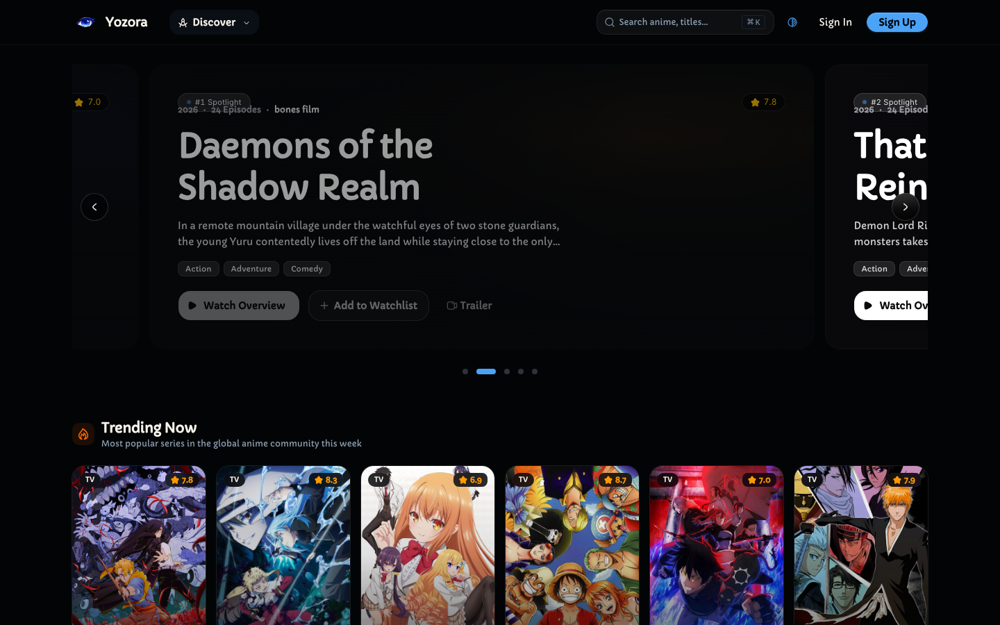

<div align="center">

# Yozora (夜空)

**The modern anime discovery engine, broadcast radar, and theme song player.**

[Live Application](https://yozora.moe) · [Report Bug](https://github.com/shiinasaku/yozora/issues) · [Feature Request](https://github.com/shiinasaku/yozora/issues)

<br />



</div>

---

## Overview

Yozora is a fast, modern anime web platform designed for discovering seasonal releases, tracking live television broadcast countdowns, listening to creditless opening and ending themes, and organizing personal watchlists.

## Features

- **Live Airing Radar**: Real-time episode countdowns synchronized with Japanese television broadcast schedules.
- **Theme Player**: 1080p creditless anime openings and endings with audio visualizer, playback rate controls, and picture-in-picture mode.
- **Seasonal Catalog**: Browse current and upcoming anime seasons with instant genre, score, and format filters.
- **Personal Watchlist**: Track watching progress, organize status shelves, and curate your profile.
- **Command Palette**: Instant keyboard-driven navigation and media search with `Cmd + K`.

## Tech Stack

- TanStack Start & React 19
- Tailwind CSS v4
- Base UI / shadcn
- Node.js & pnpm

## Getting Started

### Prerequisites

- Node.js (v20 or higher)
- pnpm (v9 or higher)

### Setup

1. Clone the repository:

```bash
git clone https://github.com/shiinasaku/yozora.git
cd yozora
```

2. Install dependencies:

```bash
pnpm install
```

3. Configure environment variables:

```bash
cp .env.example .env.local
```

4. Start the development server:

```bash
pnpm dev
```

Open [http://localhost:3000](http://localhost:3000) in your browser.

## Scripts

- `pnpm dev` — Start local development server
- `pnpm build` — Build production bundles
- `pnpm preview` — Preview production build locally
- `pnpm typecheck` — Run TypeScript type checking

## License

Distributed under the MIT License. See [LICENSE](LICENSE) for details.
